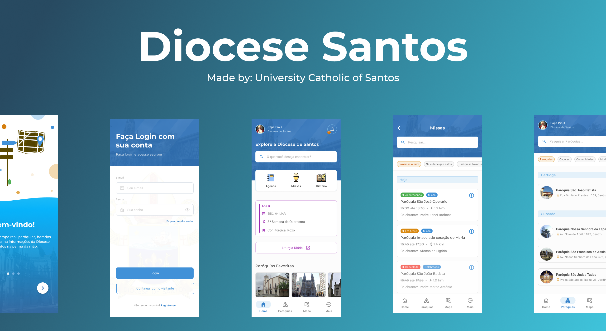

<div align="center">
  
  <h1>Diocese Santos</h1>
  <p>⛪ Aplicativo da Diocese Católica de Santos ⛪</p>
</div>

# 👀 About

Todas informações sobre a Diocese Católica de Santos da palma de suas mãos. Favorite sua paróquia, encontre os horários e atualizções sobre suas missas e confissões, e muito mais.

<div align="center">
   
</div>

<br>
<br>

# 🚀 Tecnologias

- [Flutter](https://flutter.dev/)
- [Segment](https://segment.com/)
- [Go Router](https://pub.dev/packages/go_router)
- [Rx Dart](https://pub.dev/packages/rxdart)

## 💻 Começando

### Requisitos

- [Flutter SDK](https://flutter.dev/docs/get-started/install)
- [Android Studio](https://developer.android.com/studio?hl=pt-br) or [XCode](https://developer.apple.com/xcode/)
- [Yarn](https://classic.yarnpkg.com/) or [NPM](https://www.npmjs.com/)

### Instalando e executando o projeto

_Clone o projeto e acesse a pasta_

```bash
$ git clone git@github.com:Diocese-Santos/Diocese-App.git
$ cd Diocese-App
```

_Siga as etapas abaixo_

```bash
# Instalando as depedências
$ flutter pub get

# Faça uma cópia de '.env.example' para '.env'
# e atribua as SUAS variáveis de ambiente
$ cp .env.example .env

# Finalmente, rode o aplicativo =)
$ flutter run

# Pronto, o aplicativo da Diocese está rodando!
```

### Estrutura do projeto

```
lib/
│── domain/ # Regras de negócio e entidades
│ └── entities/
│
├── infra/ # Implementações técnicas (API, repositórios, etc)
│ ├── api/
│ ├── repositories/
│ └── tracking/
│
├── main/ # Entry point da aplicação e configurações principais
│ ├── factories/
│ ├── routing/
│ └── main.dart
│
├── presentation/ # Lógica de apresentação (Presenters)
│ └── presenters/
│ └── rx/ # Implementações reativas dos presenters
│ └── \*.dart
│
├── ui/ # Interface de usuário
│  └── core/ # Temas, estilos e componentes base
│  └── pages/ # Telas da aplicação
│  └── widgets/ # Componentes reutilizáveis
```
